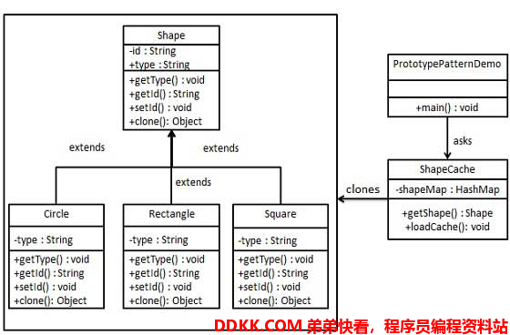

 # 原型模式
 ## 简介
```
原型模式是用于创建重复的对象，同时又能保证性能
原型模式实现了一个原型接口，该接口用于创建当前对象的克隆
当直接创建对象代价比较大时，便采用这种模式
例如，一个对象需要在一个高代价的数据库操作之后被创建
我们可以缓存该对象，在下一个请求时返回他的克隆，在需要的时候更新数据库，以此来减少数据库调用
原型模式属于创建型模式，他提供了一种创建对象的最佳方式
```
## 摘要

